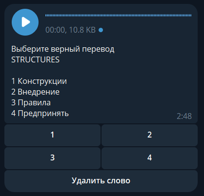
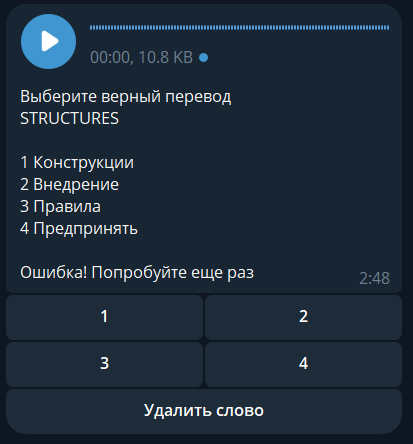
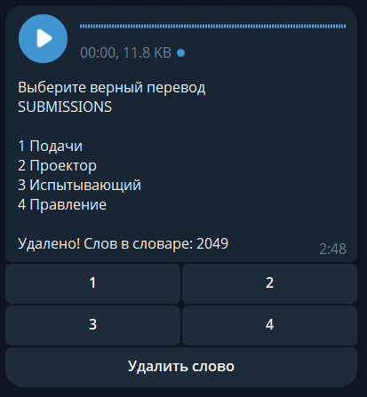
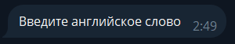
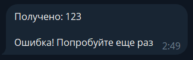
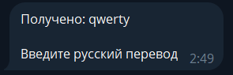
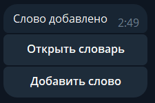
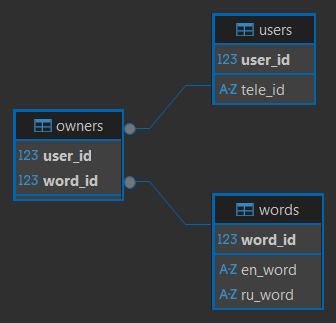

При запуске пользователя встречает приветственный экран  

При открытии словаря запускается основной тест. 
В каждом следующем вопросе дается слово на английском языке, 
его правильное аудио произношение и четыре варианта перевода на русский язык,
три из которых неправильные.
Необходимо выбрать вариант с корректным переводом  

При выборе неправильного ответа, предлагается ответить на этот вопрос еще раз  

Существует возможность удалить отображаемое английское слово по соответсвующей кнопке,
если оно по каким-то причинам более не требуется  

При выборе опции добавления слова в приветсвенном меню сначала необходимо написать англ слово   

При неверном формате будет следующее предупреждение   

Далее необходимо ввести перевод этого слова на русский язык   

Снова приветсвенное меню после добавления нового слова в словарь   

Схема БД   
